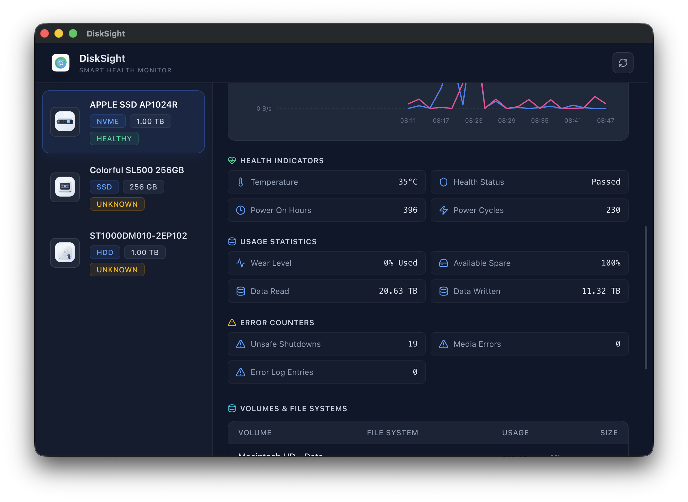
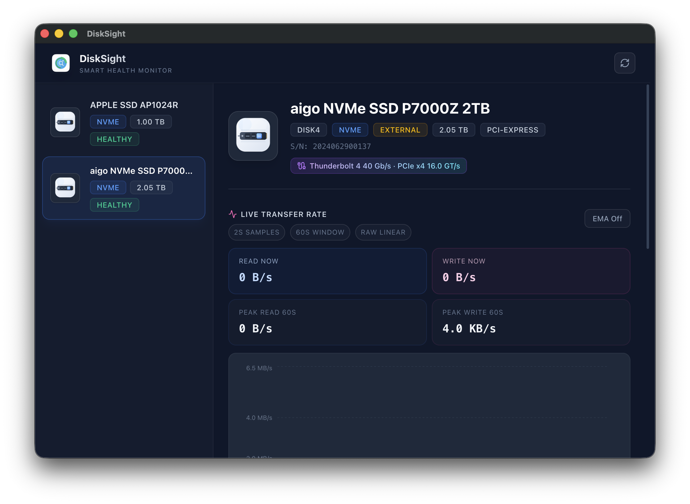

# mac-diskinfo

一个面向 macOS 的轻量磁盘信息与 SMART 健康查看工具，使用 Electron + React 构建，适合快速查看内置盘和外接盘的基础状态。

## 功能

- 扫描 macOS 上的磁盘设备
- 展示型号、容量、协议、卷信息和挂载点
- 读取并展示 SMART 基本健康数据
- 区分“设备已识别”和“SMART 可读取”
- 提供简洁的磁盘列表与详情视图

## 界面示意

### 总览页面



### 外接 NVMe 设备详情



## 技术栈

- Electron
- React + TypeScript + Vite
- Tailwind CSS
- `diskutil` / `system_profiler` / `smartctl`

## 环境要求

- macOS
- Node.js 24+
- 已安装 `smartctl`

推荐使用 Homebrew 安装：

```bash
brew install smartmontools
```

## 本地开发

```bash
npm install
npm run dev
```

## 打包

```bash
npm run build
```

构建产物默认输出到 `release/` 目录。

## AI 规则 / Skills

仓库已经内置 Apple HIG 设计规则，供不同 AI 编码工具共用：

- Codex App / Antigravity: 使用根目录 `AGENTS.md`
- 旧版 Antigravity 兼容: 使用根目录 `GEMINI.md`
- Cursor: 使用 `.cursor/rules/apple-hig.mdc`
- Canonical skill 内容: `docs/ai/skills/apple-hig/SKILL.md`

这个 skill 基于 `openclaw/skills` 的 `apple-hig`，并按本项目做了 macOS / Electron 场景适配。

## 注意事项

- 部分 USB / NVMe 外接盒不一定完整支持 SMART
- 某些磁盘在当前权限下可能无法读取 SMART 详情
- 当前项目主要面向 macOS 场景

## Roadmap

- 优化外接盘兼容性
- 展示更多原始 SMART 指标
- 支持导出诊断信息
